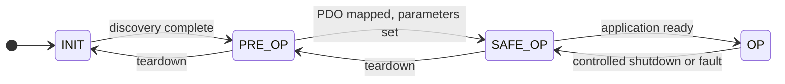

# Device States

A device on an EtherCAT network does not wake up ready to exchange process data.
It must first be walked through a defined sequence of **states**, each one unlocking
a new capability. This sequence is called the **EtherCAT State Machine (ESM)**, and it
applies to every device on the network.

Understanding the state machine is essential because bringing a network to full operation
— and diagnosing why it fails to do so — is almost entirely about navigating these states
in the correct order.

## The four states

| State | What the device can do |
| --- | --- |
| **INIT** | The device is discovered by the master. No process data exchange. Only the most basic configuration is possible. |
| **PRE-OP** | The mailbox channel is fully open. The master can read and write the object dictionary via SDO to configure the PDO layout, synchronization mode, and device parameters. |
| **SAFE-OP** | Process data exchange begins — but only for **inputs**. The device sends its sensor and status data to the master each cycle, but the master's outputs are not yet applied to the device's actuators. This state lets the master verify data is flowing before committing to control. |
| **OP** | Full cyclic operation. Both inputs and outputs are active. The device executes the master's commands on every cycle. |

## State transitions

The master requests state transitions; devices acknowledge them. Transitions can go
forward (toward OP) during startup, or backward (toward INIT) during shutdown or after
a fault.

A device can also transition directly from any state back to INIT to recover from a
serious fault, clearing all configuration and starting fresh.

## Why order matters

Each state builds on the previous one, and skipping steps causes failures that can be
hard to diagnose.

**Configuration belongs in PRE-OP.** The mailbox channel that SDO transfers use is only
reliably available once a device has reached PRE-OP. Attempting configuration while a
device is still in INIT will silently fail — the device accepts the request but ignores it
because the mailbox is not ready.

**PDO mapping must be done before SAFE-OP.** The master programs the Sync Manager sizes
based on the agreed PDO layout during PRE-OP. If the device enters SAFE-OP with the
wrong or incomplete mapping, it will refuse the transition, because it cannot safely
exchange data on a layout it was never told about.

**OP transition should not interrupt data flow.** On networks with synchronized devices,
the master should keep its process-data cycle running continuously through the SAFE-OP to
OP transition — pausing the cycle, even briefly, can cause a synchronized device to detect
a timing violation and fault.

## What happens when a transition is refused

When a device cannot accept a requested state transition, it does two things:

1. It **sets an error bit** in its state byte, so the master can detect that something
   went wrong rather than silently accepting a false "success."
2. It **records an AL status code** — a number that describes the specific reason the
   transition was refused.

**AL** stands for Application Layer. The AL status code is the device's machine-readable
explanation for a failure. Common reasons include:

- The requested transition is not valid from the current state.
- The PDO configuration is incomplete or inconsistent.
- The synchronization setup is not compatible with the device's capabilities.
- The device is still initializing internally.

When a bring-up fails, reading the AL status code from the device that refused the
transition is always the first diagnostic step.

## The startup sequence in practice

A master bringing up a network follows these steps in order:

1. **Enumerate** — scan the network to find all devices and read their vendor and product IDs.
2. **INIT** — confirm all devices have reached INIT, clearing any leftover state from a
   previous session.
3. **PRE-OP** — request PRE-OP and wait for confirmation from every device.
4. **Configure** — for each device, write the PDO mapping, synchronization mode, and any
   other parameters via SDO.
5. **SAFE-OP** — request SAFE-OP. The master begins cycling process data and verifies that
   inputs are arriving correctly from every device.
6. **OP** — request OP. Outputs are now live. The network is in full operation.

**Shutdown reverses this sequence:** OP → SAFE-OP → PRE-OP → INIT, with the master
gracefully stopping output commands before stepping back through each state.

## Next steps

Now that you understand how devices start up, the final topic is
[Clocks and Synchronization](./synchronization.md) — how EtherCAT keeps every device
acting at exactly the same instant.
