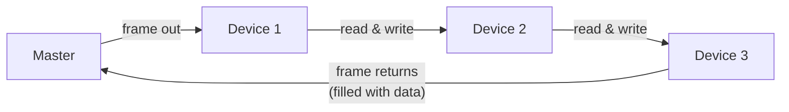

# What is EtherCAT?

EtherCAT (Ethernet for Control Automation Technology) is an industrial communication
protocol designed to connect a controller to motors, sensors, and I/O devices with
predictable, low-latency timing. It runs on standard Ethernet hardware — the same cables
and physical connectors you would use in any office network — but the way data travels
through it is fundamentally different.

## Why not just use standard Ethernet?

In a regular Ethernet network, the controller sends a separate packet to each device, waits
for a reply, and moves on to the next. With twenty drives all needing fresh commands every
millisecond, that round-trip-per-device model is far too slow and unpredictable.

EtherCAT was designed from the ground up to solve this problem.

## The core idea: processing on the fly

EtherCAT sends **one** Ethernet frame that travels through every device on the network in
sequence. As the frame passes *through* each device, that device's hardware reads the few
bytes addressed to it and writes its own response bytes into the same frame — **without
stopping the frame**. The frame continues to the next device, reaches the end of the
chain, and loops back to the controller, now carrying data from every device.

One frame, one round trip, every device updated simultaneously. This is the key to
EtherCAT's performance: there is no per-device overhead, no switching delay, and no idle
time between transactions.

## Key properties

| Property | Description |
| --- | --- |
| **Determinism** | Cycle times are fixed and predictable — the network behaves the same way on every tick of the clock. |
| **Low latency** | A full network round trip with dozens of devices completes in microseconds. |
| **Standard hardware** | Uses ordinary Ethernet cables, connectors, and physical layer chips — no specialized cabling needed. |
| **Flexible topology** | Supports line, tree, star, and ring layouts using the same wiring. |
| **Scalability** | Hundreds of devices can be connected on a single segment without degrading cycle time. |

## What EtherCAT is used for

EtherCAT is used wherever a controller must read sensors and command actuators on a strict,
repeating schedule. Common applications include:

- **Motion control** — commanding multiple servo drives in coordinated, synchronized motion.
- **Machine automation** — reading digital and analog I/O at high rates to control a
  production process.
- **Robotics** — coordinating joint drives across a robot arm with tight timing requirements.
- **Test and measurement** — capturing data from multiple sensors at a fixed, known sample rate.

## What comes next

The rest of this section builds up the full picture of how EtherCAT works:

- [Network Structure](./network-structure.md) — how the controller and devices are organized on the wire.
- [How Data Flows](./data-communication.md) — the two kinds of communication: real-time data and configuration.
- [Device States](./state-machine.md) — the startup sequence every device goes through before it can exchange data.
- [Clocks and Synchronization](./synchronization.md) — how all devices are kept in time with each other.
