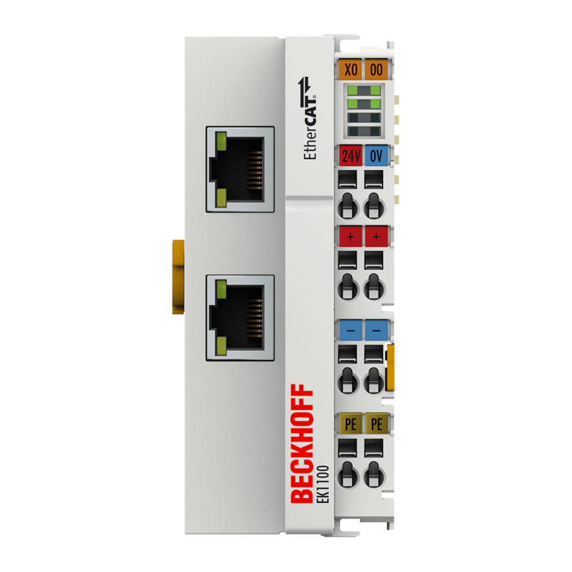

# Hardware Overview

> Sample content. Replace with the real module specifications and part numbers.

The EtherCAT hardware modules are compact, solderable system-on-modules (SoMs)
that add a ready-to-use EtherCAT device interface to your product. You bring the
application electronics; the module handles the EtherCAT communication.

## Module family

| Model | I/O | Notes |
| --- | --- | --- |
| [LXDIO33-16](./lxdio33-16/overview.md) | 16-channel digital I/O | 3.3 V EtherCAT digital I/O PCB module |
| [LXFIBER](./lxfiber/overview.md) | Fiber media | EtherCAT fiber-optic media module |
| [LXRJ45](./lxrj45/overview.md) | RJ45 ports | EtherCAT RJ45 interface module |

Each module has its own **tutorials** and **example projects** under its section
in the sidebar.

## What's on the module

- EtherCAT Slave Controller (ESC) and dual PHYs.
- Two RJ45/M8-ready ports (IN and OUT) for daisy-chaining.
- Configuration EEPROM holding the ESI (device description).
- A host interface (e.g. SPI/parallel) for your application MCU.

## Integration at a glance

1. Place the module on your carrier PCB.
2. Provide power and route the two Ethernet ports to your connectors.
3. Connect the host interface to your application processor.
4. Load/verify the device description (ESI) for your configuration.

Refer to each module's datasheet for the details.
