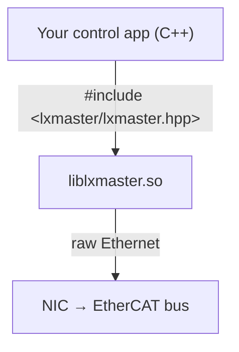

# LXMASTER

**LXMASTER** turns a standard Linux machine into a production-ready EtherCAT master. It ships as two tools that work together: a **command-line tool** for host setup, network management, and diagnostics, and a **C++ library** that abstracts the entire EtherCAT stack so your application code deals only with axes, I/O modules, and encoders — not with fieldbus plumbing.

## Architecture



---

## `lxmaster` — The CLI tool

The `lxmaster` command-line tool prepares the host and manages the network before your application runs. You do not need to write any code to use it.

- **Host setup** — a single guided command configures real-time scheduling, CPU isolation, and IRQ affinity, and qualifies the machine for DC-sync operation. Settings are written to `/etc/profile.d/lxmaster-config.sh` and picked up automatically by the library at runtime.
- **ENI management** — scan the live bus, pull ESI device description files, and generate the EtherCAT Network Information (ENI) XML that describes your network topology.
- **Run on the RT core** — launch any application inside the isolated real-time CPU slice with all environment variables forwarded, so you get deterministic scheduling without modifying your binary.
- **Debug and diagnose** — run jitter benchmarks, inspect slave states, and read DC-sync telemetry directly from the command line, without starting your application.

See the [CLI Reference](./cli.md) for the full command listing and flags.

---

## `liblxmaster` — The C++ library

`liblxmaster` abstracts the entire EtherCAT implementation behind a small, stable public API. Your application never touches raw PDO pointers, sync manager offsets, or ESM walk logic — the library handles all of that.

- **Single header** — `#include <lxmaster/lxmaster.hpp>` pulls in the whole public API under the flat `lxmaster::` namespace. No other headers are needed for application code.
- **Device handles** — work with `Axis`, `IoModule`, `Encoder`, and `GenericDevice` objects. Set targets, read feedback, and inspect faults through typed methods; the PDO mapping and cyclic exchange happen behind the scenes.
- **Lifecycle managed** — `EcNetwork::start()` handles the full ESM walk, distributed clock setup, and real-time thread launch in one call. `stop()` tears everything down cleanly.
- **Extensible** — bind a custom device profile to any slave identified by vendor ID + product code, either by subclassing a built-in profile or implementing `IDeviceProfile` from scratch.

```cpp
lxmaster::NetworkConfig cfg = lxmaster::NetworkConfig::defaults();
cfg.eni.eni_path = "network.eni.xml";

lxmaster::EcNetwork net(cfg);
net.start();
// axes(), ioModules(), encoders() are live
net.stop();
```

See [Getting Started](./getting-started.md) for a full build and run walkthrough, the [C++ API Reference](./api) for the complete reference, and [Examples](./examples) for ready-to-run projects.

---

## Where to next

- **[EtherCAT Basics](./ethercat-basics)** — foundational EtherCAT concepts before diving into LXMASTER.
- **[Getting Started](./getting-started.md)** — install LXMASTER and run your first application.
- **[C++ API Reference](./api)** — full library reference.
- **[Release Notes](./release-notes)** — version history and upgrade notes.
